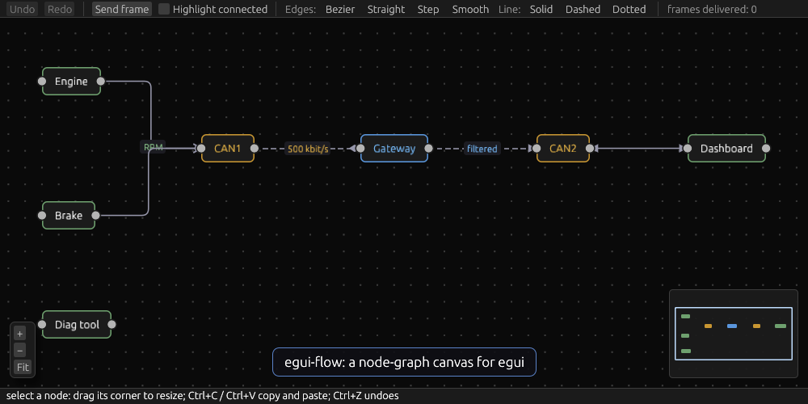
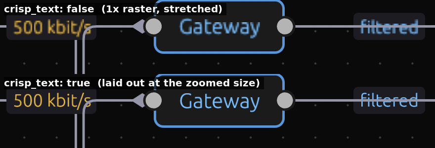
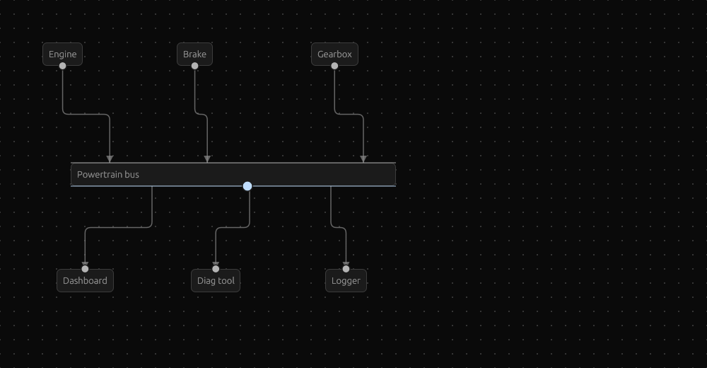
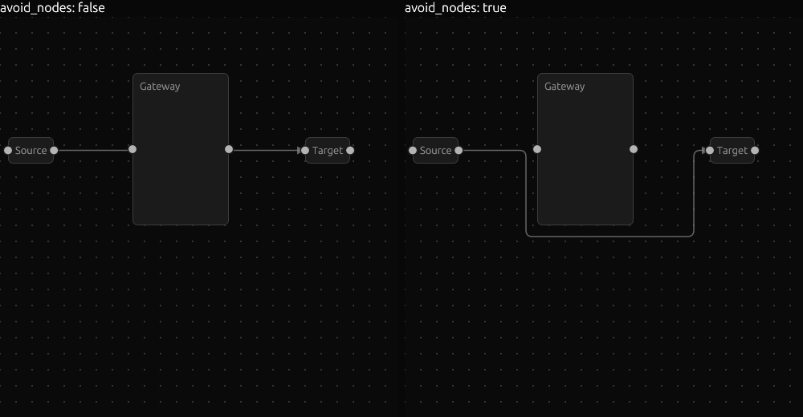
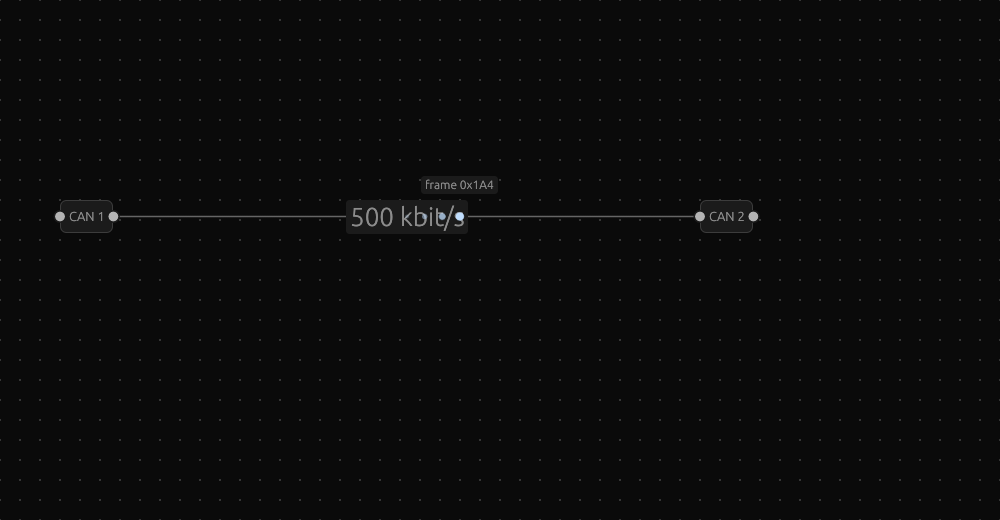
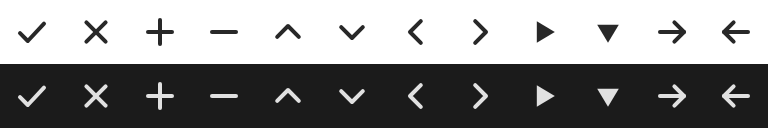

# egui-flow

[](https://github.com/niketdhale/egui-flow/actions/workflows/ci.yml)
[](https://github.com/niketdhale/egui-flow/releases)
[](LICENSE)
[](https://github.com/emilk/egui)
[](https://doc.rust-lang.org/edition-guide/rust-2024/)

A [React Flow](https://reactflow.dev/)-style node-graph canvas for [egui](https://github.com/emilk/egui), in pure Rust.



```sh
cargo run --example basic   # node graph canvas
cargo run --example gateway # the CAN-gateway demo from the tour below
cargo run --example icons   # built-in icon gallery
```

## Feature tour

One continuous take through the whole library, recorded from the real app ([`examples/gateway`](examples/gateway.rs)):


In order, with where to look:

| Caption | What it is |
|---|---|
| Pan and zoom | drag the background, wheel or pinch; `fit_view_animated` |
| Drag nodes, alignment guides | `FlowOptions::alignment_guides`; Ctrl+Z undoes the move |
| Connect | drag from one handle to another, with live validation and snapping |
| Reconnect | select an edge and drag the ring on its end; `FlowEvent::Reconnected` |
| Edge types, line styles | `EdgeKind::{Bezier, Straight, Step, SmoothStep}`, `LineStyle::{Solid, Dashed, Dotted}`, arrowheads, labels |
| Route pulses | `state.pulse_route(..)`; shapes, trails, arrival events |
| Resize | corner and edge grips on a selected node |
| Nudge | arrow keys move the selection (Shift: 10 units) |
| Highlight connected | `FlowOptions::highlight_connected` |
| Box select | Shift-drag |
| Copy, paste, undo, redo | `Editor`; Ctrl/Cmd+C, V, Z, Shift+Z |
| Delete | removes the selection and its edges |
| Groups | `Node::{is_group, parent}`, `FlowState::add_group`; drag the header and the members follow |
| Collapse | the header toggle (`FlowEvent::GroupToggled`); edges to hidden members attach to the group |
| Drag in and out | drop a node on a group to put it in, outside to take it out (`FlowEvent::ParentChanged`, `FlowOptions::group_drop`) |
| Constrained member | `Node::constrained()`: a member cannot be dragged out of its group |
| Group selected, ungroup | `FlowState::group_selected(..)`, `FlowState::ungroup(..)` |
| Auto layout | `FlowState::auto_layout_animated(..)`: a scrambled graph glides into layered order, horizontal or vertical |
| Themes | `FlowTheme::{dark, light, blueprint}` or your own colours |
| Crisp text | `FlowOptions::crisp_text`: text is laid out again at the zoomed size, see below |

### Crisp text when zoomed
The canvas is drawn into a scaled layer, so text used to be the 1x raster stretched by the zoom. With `FlowOptions::crisp_text` (on by default) it is laid out again at the zoomed size:



### Bus bars: connect anywhere along a side



Mark a handle `.along()` and wires attach wherever they are dropped on that side, not at one fixed spot. The landing point is stored on the edge (`target_offset` / `source_offset`, `0.0..=1.0`), a handle takes any number of wires, and reconnecting a wire moves only the end you drag:

```rust
fn handles(&self, node: &Node<Part>) -> Vec<Handle> {
    if node.data.is_bus_bar {
        vec![Handle::target(Handle::DEFAULT_TARGET, Side::Top).along()]
    } else {
        vec![Handle::source(Handle::DEFAULT_SOURCE, Side::Right)]
    }
}
```

Drag a wire to the edge of the bar to attach it; to start one from an `along` handle, drag from just outside that side (the bar itself stays draggable). Create them in code with `FlowState::add_edge_at(conn, source_offset, target_offset, data)`.

## Keeping wires and groups tidy

- `FlowOptions::avoid_nodes = true`: `Step` and `SmoothStep` edges route around the nodes in their way instead of crossing them (`edge_path_around` is the same router as a function).

  

- `FlowViewer::can_join_group(node, group)`: return `false` to refuse a drop into a group. Nothing changes and no `ParentChanged` event is emitted, so an `Editor` never records it.
- `FlowOptions::group_delete = GroupDelete::KeepMembers`: the Delete key removes the group and leaves its members in place (`FlowState::delete_selected_with` does the same from code).
- `PulseStyle::label_mode = PulseLabelMode::Always` shows a pulse's label while it travels; labels move out of the way of edge labels and each other.

  

- Edge style edits (`line_style`, `color`, `width`, arrowheads) are part of an `Editor` snapshot: change them, then call `editor.commit(&state)` to make the change undoable.

## Icons
Painter-drawn, so they need no font and never render as empty boxes.



## Features

| React Flow | egui-flow |
|---|---|
| Crisp text when zoomed | `FlowOptions::crisp_text` (on by default) re-lays out text at the zoomed size instead of stretching the 1x raster; the `gateway` example has a "Crisp text" checkbox to compare |
| Auto layout | `state.auto_layout(&LayoutOptions::default())`, or `auto_layout_animated(&opts, 0.7)` to glide; `LayoutDirection::{LeftToRight, TopToBottom}`, `scope` to lay out inside a group, `layout_positions` to preview |
| Exit animation | removed nodes fade out where they were (`FlowOptions::node_exit_animation`, needs `animate`) |
| Themes | `FlowOptions::theme = FlowTheme::{dark(), light(), blueprint()}` or your own `FlowTheme { background, grid, edge, selection, handle, guide, node_fill, text, .. }`; every field is optional, the default keeps egui's colours |
| Groups / sub-flows | `Node::{is_group, parent, collapsed}`; positions inside a group are relative to it; nesting, collapse, drag in and out, `group_selected`, `ungroup`, `fit_group` (see Groups below) |
| Pan / zoom viewport | drag background or middle mouse to pan, wheel / pinch to zoom (zoom-to-cursor), `fit_view()` |
| Custom nodes | implement `FlowViewer::node_ui` with any egui widgets |
| Handles | `FlowViewer::handles` — any number per node, on any side, source or target |
| Connecting | drag handle → handle, snapping, live validation (`can_connect`), `Esc` cancels |
| Many connections | a handle takes any number of wires; only exact duplicates are rejected |
| Connect anywhere | `Handle::target(id, Side::Top).along()`: a wire attaches where it is dropped along that side, and remembers it in `edge.target_offset` / `source_offset` (see Bus bars below) |
| Route around nodes | `FlowOptions::avoid_nodes`: `Step` / `SmoothStep` edges detour around nodes in their way |
| Group rules | `FlowViewer::can_join_group` refuses drops; `FlowOptions::group_delete` keeps or deletes members with a deleted group |
| Hiding handles | `FlowOptions::handle_visibility`: `Always`, `OnHover` (fade in near the node, when selected or while connecting) or `Hidden` |
| Edge types | `Bezier`, `Straight`, `Step`, `SmoothStep`; labels, arrowheads, per-edge `color` / `width` |
| Arrowheads | `edge.arrow = true` with `edge.arrow_style = ArrowStyle::{Triangle, Open, Circle, Diamond}`; `edge.arrow_at_source = true` for two-way links |
| Edge labels | `edge.label` plus `edge.label_style = EdgeLabelStyle { position, size, color, background }`; `position` runs 0.0 (source) to 1.0 (target) |
| Alignment guides | `FlowOptions::alignment_guides` snaps dragged nodes to other nodes' edges and centres and draws guide lines (`guide_threshold` px) |
| Keyboard nudge | arrow keys move selected nodes 1 unit, Shift+arrow 10; `FlowOptions::keyboard_nudge` |
| Line style and colour | `edge.line_style = LineStyle::{Solid, Dashed, Dotted, Custom { dash, gap }}`, `edge.color`, `edge.width`; `EdgeKind::Straight` for a direct line |
| Animated edges | `edge.animated = true` marches dashes (`animation_speed`, negative reverses) |
| Icons | built-in `Icon` set (check, close, plus, minus, chevrons, triangles, arrows) via `icon(ui, Icon::Check, 14.0)` / `icon_button(..)`; painter-drawn, so no font, SVG or asset is needed and they follow the text colour |
| Particles along edges | `state.pulse_edge(id, PulseStyle::default())` sends a dot source → target |
| Resize nodes | select a node and drag its corner or right/bottom edge; `Node::{fixed_size, min_size, max_size, resizable}`, `FlowOptions::nodes_resizable`, snaps to `snap_to_grid`; `FlowEvent::NodeResized { node, size, finished }` |
| Undo / redo | `Editor::new(&state)` then `editor.process(&mut state, &out.events)` each frame; Ctrl/Cmd+Z, Shift+Z / Y; or call `editor.undo(..)` / `redo(..)` from buttons |
| Copy / paste / duplicate | Ctrl/Cmd+C, X, V, D handled by the same `Editor`; or `state.copy_selected()`, `state.paste(&clipboard, offset)`, `state.duplicate_selected(offset)` (edges between copied nodes come along, ids are remapped) |
| Reconnect edges | select an edge, drag the ring on either end to another handle; the edge snaps back if dropped on nothing; `FlowEvent::Reconnected { edge, old, new }`; `FlowOptions::edges_reconnectable` |
| Highlight connected | `FlowOptions::highlight_connected` / `Flow::highlight_connected(true)` dims everything not connected to the selected or hovered node |
| Route pulses | `state.pulse_route(start_node, &[edge, edge, ..], style)` animates a multi-hop route leg by leg, picking forward/reverse per edge |
| Pulse direction, delay, label | `PulseStyle { direction: PulseDirection::Reverse, delay, label, .. }` or `pulse_edge_reverse`; delays let you sequence the legs of a route; the label shows on hover, or all the time with `label_mode: PulseLabelMode::Always`, and keeps clear of edge labels; `shape` (`Circle`/`Square`/`Diamond`/`Arrow`), `easing`, `trail` and `tag`; `FlowEvent::PulseArrived { edge, tag, direction }` fires when a leg ends |
| Pulse limits | `state.max_pulses_per_edge` (default 8) and `state.pulse_overflow` (`Drop` or `ReplaceOldest`) |
| `fitView({ duration })`, zoom easing | `state.fit_view_animated(secs)`, `state.animate_viewport(vp, secs)`; zoom/fit buttons ease; user input cancels |
| Node enter transition | nodes added after the first frame fade in |
| Selection | click, shift-click, shift-drag box select, `Delete`/`Backspace` removes |
| `snapToGrid` | `FlowOptions::snap_to_grid` |
| `<Background>` | `Dots`, `Lines`, `Cross`, `None` |
| `<MiniMap>` / `<Controls>` | `FlowOptions::{minimap, controls}` |
| `onConnect`, `onNodesDelete`, … | `FlowEvent` values returned from `show` |

## Installation

egui-flow is not on crates.io yet; depend on a tagged release from GitHub:

```toml
[dependencies]
egui-flow = { git = "https://github.com/niketdhale/egui-flow", tag = "v0.2.0" }
```

It targets egui 0.33. Releases follow [Semantic Versioning](https://semver.org/) (below 1.0, a minor release may include breaking changes); see the [changelog](CHANGELOG.md) and the [releases page](https://github.com/niketdhale/egui-flow/releases).

## Usage

```rust
use egui_flow::{Flow, FlowEvent, FlowState, FlowViewer, Node};

struct Viewer;
impl FlowViewer<String, ()> for Viewer {
    fn node_ui(&mut self, ui: &mut egui::Ui, node: &mut Node<String>) {
        ui.text_edit_singleline(&mut node.data);
    }
}

// once
let mut state: FlowState<String, ()> = FlowState::new();
let a = state.add_node(egui::pos2(0.0, 0.0), "a".into());
let b = state.add_node(egui::pos2(250.0, 60.0), "b".into());
state.connect(a, b, ());

// every frame
let out = Flow::new("graph").minimap(true).show(ui, &mut state, &mut Viewer);
for event in out.events {
    if let FlowEvent::Connected(edge) = event { /* mirror into your model */ }
}
```

`FlowState` is plain data (`nodes`, `edges`, `viewport`) that you own and may mutate between frames.
Node sizes are measured from the rendered content each frame. Enable the `serde` feature to serialize nodes, edges and the viewport.

## Pulses

```rust
use egui_flow::{PulseDirection, PulseOverflow, PulseShape, PulseStyle};

// A whole route in one call: each leg starts when the previous one arrives, and
// forward/reverse is worked out per edge from the starting node.
state.pulse_route(engine, &[engine_to_can1, can1_to_gateway, gateway_to_can2], PulseStyle {
    shape: PulseShape::Arrow,
    label: Some("0x1A0".into()),
    tag: 7, // comes back in FlowEvent::PulseArrived
    ..Default::default()
});
// Or one leg at a time, with your own delay.
state.pulse_edge(can1_to_gateway, PulseStyle { delay: 0.5, ..Default::default() });
// Bus → receiver, against the edge's own direction.
state.pulse_edge_reverse(bus_to_ecu, PulseStyle::default());

state.max_pulses_per_edge = 16;
state.pulse_overflow = PulseOverflow::ReplaceOldest; // newest pulse wins under heavy traffic
```

## Undo, redo, copy and paste

```rust
use egui_flow::Editor;

// `N` and `E` must be `Clone`.
let mut editor = Editor::new(&state);

// every frame
let out = Flow::new("graph").show(ui, &mut state, &mut viewer);
editor.process(&mut state, &out.events);

if ui.add_enabled(editor.can_undo(), egui::Button::new("Undo")).clicked() {
    editor.undo(&mut state);
}
```

A history step is recorded after a node drag, connect, reconnect, delete, resize, paste, cut or duplicate. Changes you make yourself (editing node data, adding nodes in code) are not seen; call `editor.commit(&state)` after them to make them undoable. The shortcuts only fire while the pointer is over the canvas and no text field has focus; turn them off with `FlowOptions { keyboard_shortcuts: false, .. }`.

## Resizing nodes

Selected nodes show grips on the corner and the right and bottom edges. Dragging sets `node.fixed_size` (width exact, height a minimum, so the content never gets clipped); set it yourself, or build a node with `Node::new(..).with_size(vec2(220.0, 120.0))`. Clear it with `node.fixed_size = None` to go back to sizing from the content. Limit the range with `min_size` / `max_size`, or opt a node out with `resizable = false`.

## Reconnecting and highlighting

```rust
let opts = FlowOptions { highlight_connected: true, ..Default::default() };
let out = Flow::new("graph").options(opts).show(ui, &mut state, &mut viewer);
for event in out.events {
    match event {
        // The edge already carries `new`; mirror it into your own model.
        FlowEvent::Reconnected { edge, old, new } => { /* ... */ }
        FlowEvent::PulseArrived { edge, tag, .. } => { /* a frame reached the end of a leg */ }
        _ => {}
    }
}
```

## Groups

A group is a node that contains other nodes. Give a node a `parent` and its `position` becomes relative to that group, so moving the group moves everything inside. Groups nest.

```rust
let group = state.add_group(egui::pos2(0.0, 0.0), egui::vec2(300.0, 200.0), Data::group("Powertrain"));
let engine = state.add_node(egui::pos2(20.0, 50.0), Data::ecu("Engine"));
state.node_mut(engine).unwrap().parent = Some(group); // position is now relative to the group
// or move an existing node in without it moving on screen:
state.set_parent(brake, Some(group));

state.group_selected(Data::group("Group"), 24.0, 30.0); // wrap the selection
state.fit_group(group, 24.0, 30.0);                    // resize a group to hug its members
state.set_collapsed(group, true);                      // hide the members
state.ungroup(group);                                  // members move up a level, in place
```

What the canvas does for you:
* A group draws behind its members. Only its header (`FlowOptions::group_header_height`) is grabbable, so empty space inside an open group still pans and box-selects; a collapsed group is grabbable all over.
* Every group has a collapse toggle in its header's top-right corner; leave a little room there in `node_ui`. A collapsed group shrinks to its header, hides its members, and edges to hidden members attach to the group's sides (edges wholly inside it are not drawn).
* Dropping a node on a group puts it in that group; dropping it outside its group takes it out (`FlowOptions::group_drop`). Both report `FlowEvent::ParentChanged`.
* Dragging, nudging, copying and deleting a group take its members along. To delete a group but keep its members, `ungroup` it first.
* A box select picks an open group only when the box covers all of it, so a box drawn inside one selects its members.
* `node.constrain_to_parent = true` (or `Node::constrained()`) keeps a member inside its group, below the header, while it is dragged or nudged.

Inside `Flow::show` (including your `FlowViewer` callbacks) node positions are in flow space; outside it, use `FlowState::abs_position` / `abs_rect` for flow-space positions of nodes in groups. `FlowState::bounds` already accounts for groups and ignores hidden members.

## Auto layout

```rust
use egui_flow::{LayoutDirection, LayoutOptions};

state.auto_layout(&LayoutOptions::default());                    // jump there
state.auto_layout_animated(&LayoutOptions::default(), 0.7);      // or glide; FlowEvent::LayoutFinished at the end
state.auto_layout(&LayoutOptions { direction: LayoutDirection::TopToBottom, ..Default::default() });
state.auto_layout(&LayoutOptions { scope: Some(group), ..Default::default() }); // inside one group, then refit it
let plan = state.layout_positions(&LayoutOptions::default());    // preview, moves nothing
```

Edges point from source to target, so a source ends up left of (or above) its targets. Cycles are broken, crossings are reduced, nodes never overlap, and parts of the graph that are not connected are stacked. Sizes come from the last frame, so lay out after the nodes have been shown once. A group is one block of its current size; its members keep their places inside it. A running animated layout is cancelled by starting to drag a node. `Editor` records `LayoutFinished` as one undo step; after a plain `auto_layout` call `editor.commit(&state)`.

## Themes

```rust
use egui_flow::FlowTheme;

let opts = FlowOptions { theme: FlowTheme::blueprint(), ..Default::default() };   // or dark(), light()
let opts = FlowOptions {
    theme: FlowTheme { background: Some(my_bg), selection: Some(my_accent), ..Default::default() },
    ..Default::default()
};
```

Every field is optional; `None` keeps the colour derived from egui's `Visuals`. The theme covers the canvas, grid, edges, selection, handles, alignment guides, labels, minimap, and the default node frame and text. Colours you set yourself in `node_ui` or `node_frame` still win.

## Multiple connection points

Give a node several handles from `FlowViewer::handles`, each with its own side and `offset` (`0.0..=1.0` along that side), and select them with `source_handle` / `target_handle` on the edge, so a gateway's wires to CAN1 and CAN2 leave from different points:

```rust
fn handles(&self, _node: &Node<Ecu>) -> Vec<Handle> {
    vec![
        Handle::target(Handle::DEFAULT_TARGET, Side::Left),
        Handle::source(HandleId(10), Side::Right).with_offset(0.3), // CAN1
        Handle::source(HandleId(11), Side::Right).with_offset(0.7), // CAN2
    ]
}
```

## Icons

```rust
use egui_flow::{Icon, icon, icon_button};

icon(ui, Icon::Check, 14.0);
if icon_button(ui, Icon::Close, 14.0).clicked() { /* ... */ }
Icon::TriangleDown.paint(ui.painter(), rect, color); // at a position of your choice
```

The icons are drawn with egui's painter, so they never render as empty boxes like missing font glyphs. `Icon::ALL` lists them.

## Development

```sh
cargo fmt --check
cargo clippy --all-targets --all-features -- -D warnings
cargo test --all-features      # unit + render tests (they inspect the painted shapes)
cargo test --lib               # without the optional serde feature
cargo build --examples --all-features
RUSTDOCFLAGS="-D warnings" cargo doc --no-deps --all-features
```

CI runs all of these on Linux, and the library tests on Windows and macOS too.

### Releasing

1. Bump `version` in `Cargo.toml` and add a dated `## [x.y.z] - YYYY-MM-DD` section (and link) to `CHANGELOG.md`; a test fails if they disagree.
2. Merge to `main`.
3. Publish: push the tag (`git tag -a vx.y.z -m "egui-flow x.y.z" && git push origin vx.y.z`), or open **Actions → Release → Run workflow** on `main` and enter `vx.y.z` to have it tag the commit for you.

The Release workflow re-runs the checks, verifies the tag matches `Cargo.toml`, and creates the GitHub Release from the changelog.

If a release was cut with the wrong version, **Actions → Delete release → Run workflow** on `main` removes the release and its tag (type the tag twice to confirm); then release again with the right one.

## Animation

Everything above that moves can be disabled at once with `FlowOptions { animate: false, .. }` (reduced motion): view transitions jump, nodes appear instantly and hover easing is skipped. Edges you marked `animated` and explicit `pulse_edge` calls are your own choice and keep running. Pulses are capped per edge (8 by default, see above) so a burst of events can't pile up.

## Notes

* Zooming scales the node content with a layer transform. Text is laid out again at the zoomed size (`crisp_text`) so it stays sharp; other painted content, such as images, is scaled as usual.
* Selectable labels are disabled inside nodes so dragging on text moves the node; re-enable in `node_ui` if needed.
* Resizing sets a size; it does not make node content scale.
* No node exit animation (removed nodes vanish immediately) or per-edge dash patterns.
* Not yet implemented: edge routing around nodes, and nodes of different kinds sharing one layout (everything in a scope is laid out by its edges alone).
